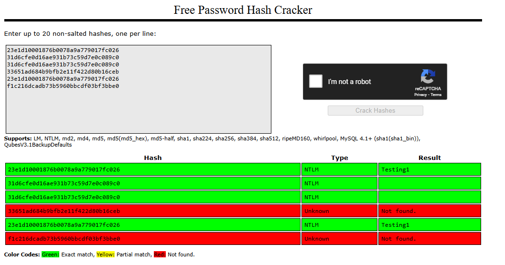

# Windows Forensics 1

> Let's dive into windows forensics, using forensics tools we will see how to extract files, passwords and more out of what is available on windows

# Volatility

## Extract passwords from memory

with a memory dump that can be obtained from a cumputer crash (good old blue screen of the death) or from a direct dump using tools sutch as [magnet](https://www.magnetforensics.com/resources/magnet-ram-capture/) or [drackvuf](https://richard-juan.com/#0x10_libvm_setup)

for this example we gonna extract and crack user's passwords using [volatility](https://volatilityfoundation.org/) and [crackstation](https://crackstation.net/) but you can do it localy with [john the ripper](https://www.openwall.com/john/) and a dictionary like [rockyou.txt](https://github.com/zacheller/rockyou):

```powershell
vol3 --file mem.dmp windows.hashdump
```

can take a while depending on the size of the dump

```powershell
User                    rid     lmhash                                  nthash

Administrator           500     aad3b435b51404eeaad3b435b51404ee        23e1d10001876b0078a9a779017fc026
Guest                   501     aad3b435b51404eeaad3b435b51404ee        31d6cfe0d16ae931b73c59d7e0c089c0
DefaultAccount          503     aad3b435b51404eeaad3b435b51404ee        31d6cfe0d16ae931b73c59d7e0c089c0
WDAGUtilityAccount      504     aad3b435b51404eeaad3b435b51404ee        33651ad684b9bfb2e11f422d80b16ceb
securitynik             1001    aad3b435b51404eeaad3b435b51404ee        23e1d10001876b0078a9a779017fc026
nakia                   1003    aad3b435b51404eeaad3b435b51404ee        f1c216dcadb73b5960bbcdf03bf3bbe0
```



as you can see, the administrator's and securitynik's password is "Testing1" where the guest account and default account have blank passwords

## Looking at the network

by using the netstat pluging, we can see all the connections and runnin servers

```powershell
vol3 --file mem.dmp windows.netstat > netstat.txt
```

```powershell
Volatility 3 Framework 2.8.0

Offset  Proto   LocalAddr       LocalPort       ForeignAddr     ForeignPort     State   PID     Owner   Created

0xe78bf48cd010  TCPv4   10.0.0.108      4444    10.0.0.110      38159   ESTABLISHED     -       -       N/A
0xe78bf533dac0  TCPv4   10.0.0.108      49957   10.0.0.110      443     ESTABLISHED     -       -       N/A
0xe78bf4f0daa0  TCPv4   10.0.0.108      49685   10.0.0.101      4444    ESTABLISHED     -       -       N/A
0xe78bf3ea6ae0  TCPv4   10.0.0.108      49686   10.0.0.110      22      ESTABLISHED     -       -       N/A
0xe78bf69bbb00  TCPv4   127.0.0.1       9999    127.0.0.1       50369   CLOSED  -       -       N/A
0xe78bf33adaa0  TCPv4   127.0.0.1       9999    127.0.0.1       50366   CLOSED  -       -       N/A
0xe78bf2daa340  TCPv4   0.0.0.0 22      0.0.0.0 0       LISTENING       3972    sshd.exe        2023-11-16 19:09:58.000000 UTC
0xe78bf2daa340  TCPv6   ::      22      ::      0       LISTENING       3972    sshd.exe        2023-11-16 19:09:58.000000 UTC
0xe78bf2daa4a0  TCPv4   0.0.0.0 22      0.0.0.0 0       LISTENING       3972    sshd.exe        2023-11-16 19:09:58.000000 UTC
0xe78bf3af4740  TCPv4   0.0.0.0 80      0.0.0.0 0       LISTENING       10008   httpd.exe       2023-11-16 23:26:16.000000 UTC
0xe78bf3af4740  TCPv6   ::      80      ::      0       LISTENING       10008   httpd.exe       2023-11-16 23:26:16.000000 UTC
0xe78bf3af5920  TCPv4   0.0.0.0 80      0.0.0.0 0       LISTENING       10008   httpd.exe       2023-11-16 23:26:16.000000 UTC
0xe78bf274b4f0  TCPv4   0.0.0.0 135     0.0.0.0 0       LISTENING       412     svchost.exe     2023-11-16 19:09:15.000000 UTC
0xe78bf274b4f0  TCPv6   ::      135     ::      0       LISTENING       412     svchost.exe     2023-11-16 19:09:15.000000 UTC
0xe78bf00fd0d0  TCPv4   0.0.0.0 135     0.0.0.0 0       LISTENING       412     svchost.exe     2023-11-16 19:09:15.000000 UTC
0xe78bf274a470  TCPv4   10.0.0.108      139     0.0.0.0 0       LISTENING       4       System  2023-11-16 19:09:08.000000 UTC
0xe78bf3af5ea0  TCPv4   0.0.0.0 443     0.0.0.0 0       LISTENING       10008   httpd.exe       2023-11-16 23:26:16.000000 UTC
0xe78bf3af5ea0  TCPv6   ::      443     ::      0       LISTENING       10008   httpd.exe       2023-11-16 23:26:16.000000 UTC
0xe78bf3af4060  TCPv4   0.0.0.0 443     0.0.0.0 0       LISTENING       10008   httpd.exe       2023-11-16 23:26:16.000000 UTC
0xe78bf2da9dc0  TCPv4   0.0.0.0 445     0.0.0.0 0       LISTENING       4       System  2023-11-16 19:09:48.000000 UTC
0xe78bf2da9dc0  TCPv6   ::      445     ::      0       LISTENING       4       System  2023-11-16 19:09:48.000000 UTC
0xe78bf3af5be0  TCPv4   0.0.0.0 3306    0.0.0.0 0       LISTENING       9044    mysqld.exe      2023-11-16 23:26:13.000000 UTC
0xe78bf3af5be0  TCPv6   ::      3306    ::      0       LISTENING       9044    mysqld.exe      2023-11-16 23:26:13.000000 UTC
0xe78bf2da96e0  TCPv4   0.0.0.0 5040    0.0.0.0 0       LISTENING       5436    svchost.exe     2023-11-16 19:11:49.000000 UTC
0xe78bf2daa600  TCPv6   ::1     9999    ::      0       LISTENING       4444    ssh.exe 2023-11-16 21:15:54.000000 UTC
0xe78bf2daa760  TCPv4   127.0.0.1       9999    0.0.0.0 0       LISTENING       4444    ssh.exe 2023-11-16 21:15:54.000000 UTC
...
```

here we can see that ssh, http and mysql server are running.
from there we can dump the process and look for more info

```powershell
vol3 --file mem.dmp windows.pslist --pid 10008 --dump

strings 10008.httpd.exe.0x7ff69ef60000.dmp | grep -B 1 -A 1 -i version
```

where we get the version of the http server `2.4.56`

```
--
Apache HTTP Server
FileVersion
2.4.56
--
Apache HTTP Server
ProductVersion
2.4.56
--
```

## Looking at the registry

we can check if any program is ment to run on startup

```powershell
vol3 --file mem.dmp windows.registry.printkey.PrintKey --key "Software\Microsoft\Windows\CurrentVersion\Run" | grep REG_SZ
```

```
2023-07-12 04:42:30.000000 UTC  0xb98420e97000inREG_SZ  \??\C:\Windows\ServiceProfiles\LocalService\NTUSER.DAT\Software\Microsoft\Windows\CurrentVersion\Run    OneDriveSetup   "C:\Windows\System32\OneDriveSetup.exe /thfirstsetup"   False
2023-07-12 04:42:29.000000 UTC  0xb98421072000  REG_SZ  \??\C:\Windows\ServiceProfiles\NetworkService\NTUSER.DAT\Software\Microsoft\Windows\CurrentVersion\Run  OneDriveSetup   "C:\Windows\System32\OneDriveSetup.exe /thfirstsetup"   False
```

nothing spetial here

## user command line history

here we start by looking at files in memory

```powershell
vol3 --file mem.dmp windows.filescan > filescan.txt
cat filescan.txt | grep history
```

```
0xe78bf2f82a00  \Users\securitynik\AppData\Roaming\Microsoft\Windows\PowerShell\PSReadLine\ConsoleHost_history.txt
```

```powershell
vol3 --file mem.dmp windows.dumpfiles --virtaddr 0xe78bf2f82a00
cat file.0xe78bf2f82a00.0xe78bf66cc6d0.DataSectionObject.ConsoleHost_history.txt.dat
```

```
Invoke-WebRequest -Uri http://10.0.0.106/putty.exe
dir
cd ..
dir
Invoke-WebRequest -Uri http://10.0.0.106/putty.exe putty.exe
exit
d:
cmd
exit
cd \
cd tools
cd .\SysinternalsSuite\
.\procdump.exe -ma lsass.exe c:\tmp\lsass.dmp
ps
.\procdump.exe -ma TabTip tabtip.dmp
.\procdump.exe -ma msedge.exe msedge.dmp
del *.tmp
del *.dmp
dir *.dmp
del .\notepad.dmp .\firefox.dmp
del .\FindLinks.exe
del .\firefox.dmp
cd \
cd tools
cd .\SysinternalsSuite\
del .\firefox.dmp
.\procdump.exe -ma msedge.exe c:\tmp\edge.dmp
dir c:\tmp\edge.dmp
.\procdump.exe -ma lsass.exe c:\tmp\lsass.exe.dmp
dir c:\tmp
.\procdump64.exe /?
.\procdump.exe -64 -ma lsass.exe c:\tmp\lsass.exe.dmp
.\procdump.exe -accepteula -64 -ma lsass.exe c:\tmp\lsass.exe.dmp
cls
psexec -h
cmd
cd 'C:\Program Files\'
dir
cd ..
cd '.\Program Files (x86)\'
dir
cd .\Microsoft\
dir
cd .\Edge\
dir
cd .\Application\
dir
cd .\114.0.1823.79\
dir
.\msedge.exe --proxy-server="socks5://127.0.0.1:9999"
cd "c:\Program Files (x86)\Google\Chrome\Application\"
cd "c:\Program Files (x86)\Google\Chrome\Application\"cd ..
cd ..
cd \
cd '.\Program Files\'
dir
cd .\Google\
dir
cd .\Chrome\
dir
cd .\Application\
dir
chrome.exe --proxy-server="socks5://127.0.0.1:9999"
dir
chrome.exe --proxy-server="socks5://127.0.0.1:9999"
cmd
dir /s c:\nmap.exe
```

## Conclusion

as you can see, we can do a lot with a memory dump and volatility, from extracting files or process, getting network info or passwords.
there is way more that can be donne, like looking for malware or rootkit that hide from the system using malfind plugin and more, but that's a topic for an other time
