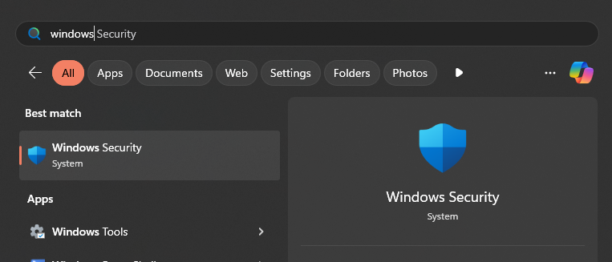
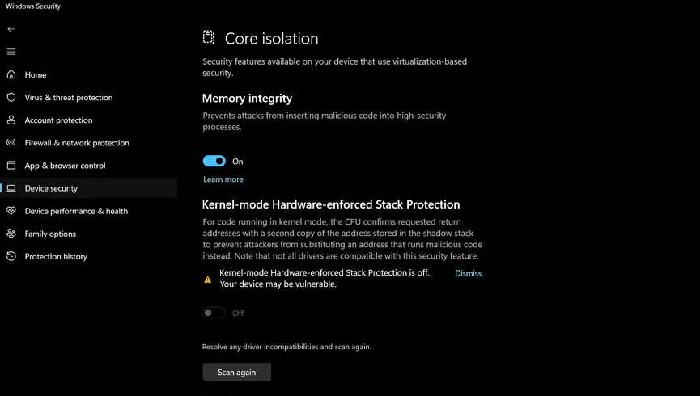
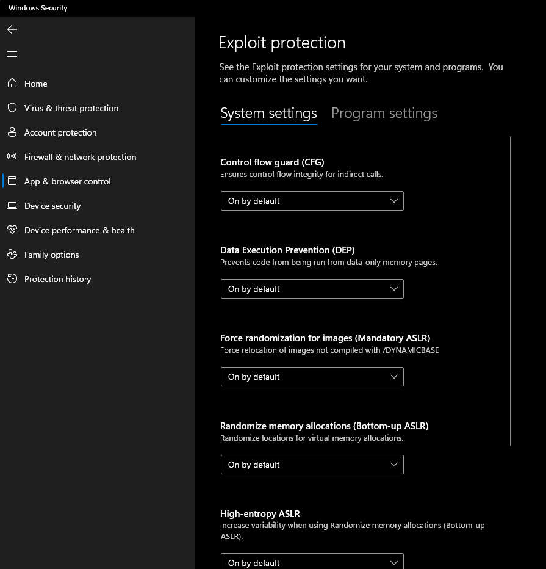
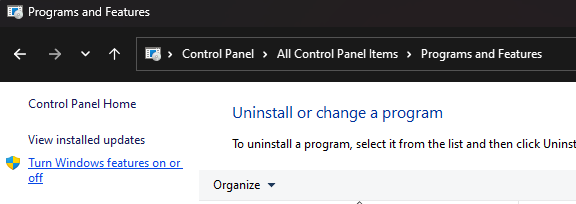
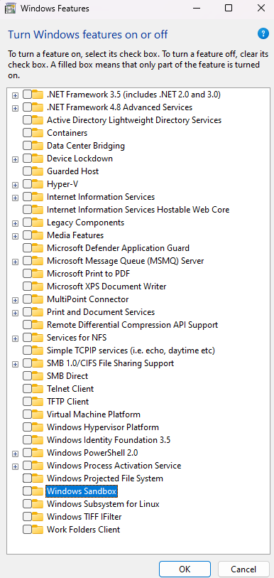
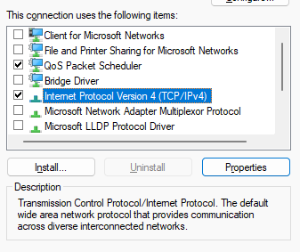
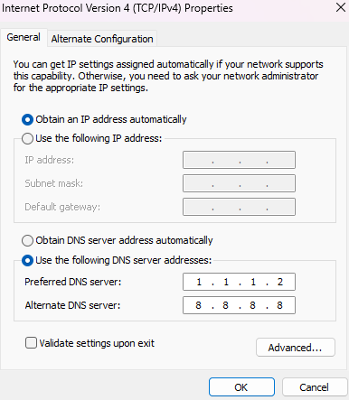
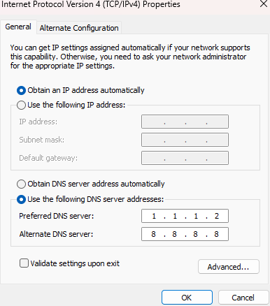
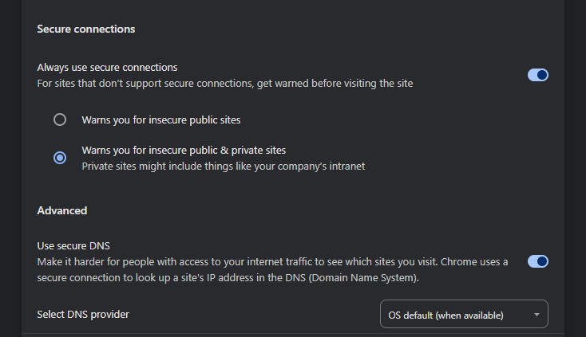
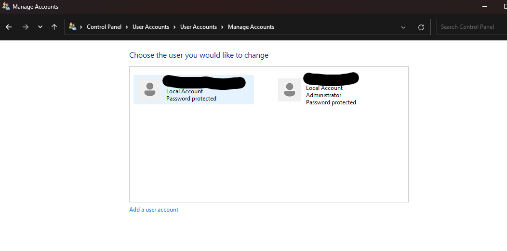

# Securing Windows

> Guide to harden windows client security by udelising tools and configuration
> making life harder for malware and hacker to exploit your home computer

# Windows security

## device security

### Core insolation

This feature basicly run core system programs in a virtual invironement in order to not make them easely interacted by third party programs.

### Kernel-mode Hardware-enforce Stack Protection

this feature is basicly a stack guard, it make sure that a vulnerable driver has not been exploited by a stack overflow by checking that the return adress is the proper one before returning.

must be turned on if your processor is compatible, may also slow down your processor a bit.

### Memory access protection

this feature unallow pluged in devices, like a thunderbold malicious device to get direct memory access and extract credentials or inject malitious code into running programs.

there is a nice [video](https://www.youtube.com/watch?v=q0HthE3qDMw) made at blackhat 2013 explaining this in more details

### Microsoft Vulnerable Driver Blocklist

this feature disable known vulnerable drivers or malware signed drivers that would allow an attaker to have full control of your machine .

Other features might be available depending on your machine or new microsoft updates, most of them are recomanded to turn on and cause no trouble in most profetional use cases.

## App & Browser control

### Exploit protection

All those options can be enforced by selecting "On by default" witch force them on programs and app even if not compiled with the flag

they are exploit mitigation technics that make it way harder for an attacker to be able to exploit a bug in a program. by puting safe guards in place in the heap, the stack and more. also forcing a high memory randomisation to prevent memory adress brutforce.

all the good stuff to make sure you're not smashing the stack like it's the 90's :)

## removing unused features

Basicly, remove everything unless you explicitly need it.
most people don't need any of those.
for my part, sometimes i might need hyper-v, sandbox or subsystem for linux. but i enable them wen needed and disable them otherwise.

## Disable network features

If you can disable your wifi and bluetooth adapter
go to contol panel > network and internet > network and sharing center > Change adapter settings
then right click on them and click "Disable"

then on the adapter you are using, right click and click on "Properties"
then uncheck all items but "Qos Packet Scheduler" and "Internet Protocol Version 4 (TCP/IPv4)"

Also click on "Internet Protocol Version 4 (TCP/IPv4)" and the "Properties" button.
It's better to use a static ip adress if you have control over your router and disable it's dns server but most importantly it's good to enforce a secure dns provider like cloudfare's "1.1.1.2" that will encrypt your dns request to avoid leak and tempering with your internet usage.

also make sure your browser is configured to encrypt dns comunication

#### Remove tuneling

this is optional since there is no use of ipv6 , but it's a good thing to remove the "tunnel.sys" driver in the windows\system32\drivers folder. it's used by malware to tunnel ipv4 into ipv6 in order to bypass firewall rules.

## Accounts

Obviouly having a strong passwords is easy to understand in nowaday but most people forget that the main user can be unprivileged as long as an administrator user exist on the machine.
this prevent some privilege escalation senario and also force UAC the ask for credentials each time elevated privilege is required. witch prevent [Rubber ducky](https://www.youtube.com/watch?v=sbKN8FhGnqg) attacks and back then (not sure if it's still the case nowadays) prevented 95% of all viruses and malware from operating.

## Final Note

- make sure you have secure boot enabled in your BIOS and you are running in UEFI mode.
- make sure you don't have the USB keys, lan or CDRom as default boot.
- password protect your BIOS access
- Encrypt your harddrive if paussible

There is a lot that can be done to secure your computer even further, using and EDR like [Comodo](https://antivirus.comodo.com/) to detect if a process like notepad is suddenly trying to open a firewall port or inject code into an other process.
using [processExplorer](https://learn.microsoft.com/en-us/sysinternals/downloads/process-explorer) to send a suspitious process to virustotal.
making your machine look like a VM environement to make the malware think it is beeing whatched.
hardening windows defender behaviour using [ConfigureDefender](https://github.com/AndyFul/ConfigureDefender) and more.

but that's a topic for an other post, hope you enjoyed and learned one thing or two :)
