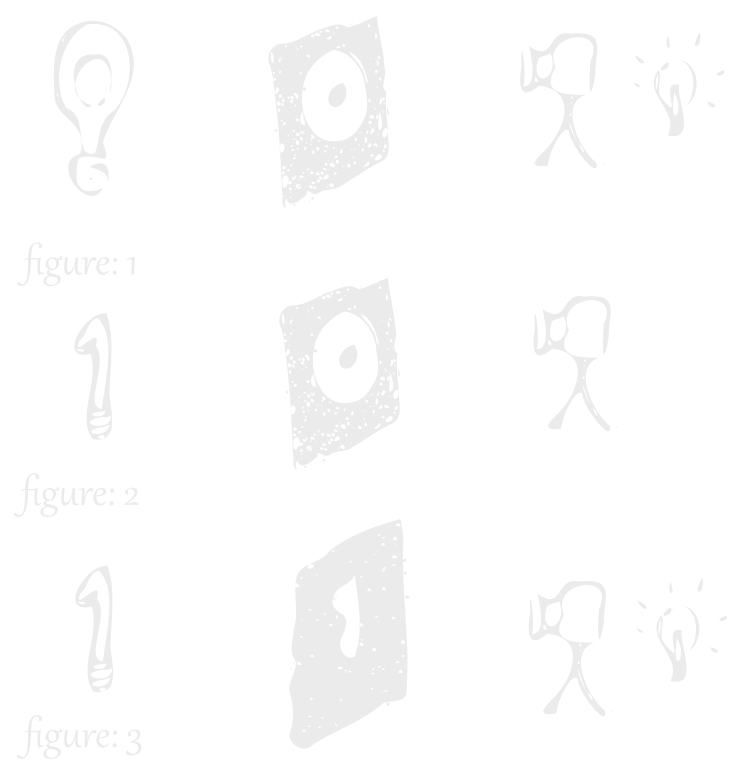

# Google codelab

> Using AI to detect breast cancer from petscans
> and beeing able to detect cancer cells with a 98% accuracy.
> following this article you will be able to do it too :)

## A bit of knolege

Convolutional network are easy to understand, they are basicly just puting to filter on top of one other and seeing how mutch light go throu.



in figure 1 we have a lightbulb in the shape of a 0 and a filter in the same shape, the camera detect suffitient light going throu so we can say it's a 0 shaped lightbulb
in figure 2 the lightbulb is shaped into a 1 and there is not enouth liht to triger the camera
where in figure 3 the lightbulb and the filter are matching therefore the camera is trigered.

to produce the filter we train our network with a big enouth dataset to refine each filters to create a shape detector.

it's oversimplified but it's basicly how a convolutional network function, it's used in image detection [like yolo with darknet](https://darknetcv.ai/) and other neural network library.

## image dection of cancer cells

first we gonna need a dataset, we gonna use [kaggle](https://www.kaggle.com/) for that.
it's a large library of datasets with a lot of public domain's one.
you gonna need to loggin and generate an api key and download it in a json form

the following was done using [google codelab](https://colab.research.google.com/) so you can use a nice gpu with 12gb of ram for free :)

### Setup

add the json key to the main directory then follow the instructions to download and unzip the dataset

```bash
!pip install kaggle

!mkdir -p ~/.kaggle
!cp kaggle.json ~/.kaggle/
!chmod 600 ~/.kaggle/kaggle.json

!kaggle datasets download paultimothymooney/breast-histopathology-images
```

```python
import zipfile

with zipfile.ZipFile('breast-histopathology-images.zip', 'r') as zip_ref:
    zip_ref.extractall('breast-histopathology-images')
```

we then import the library and check that the dataset is proprely set

```python
import tensorflow as tf
from tensorflow.keras import models, layers
import matplotlib.pyplot as plt

import tensorflow as tf
from tensorflow.keras.preprocessing.image import ImageDataGenerator
from tensorflow.keras.preprocessing import image
from sklearn.metrics import accuracy_score, confusion_matrix
import seaborn as sns
import os
import PIL
import pandas as pd
import numpy as np
from tensorflow.keras.layers import Rescaling
import glob
import cv2

from sklearn.metrics import classification_report
from tensorflow.keras.models import Sequential
from tensorflow.keras.layers import Dense, Conv2D,MaxPooling2D, Flatten, Dropout, BatchNormalization
from tensorflow.keras.optimizers import SGD
from tensorflow.keras.optimizers import Adam, SGD
from keras.metrics import binary_crossentropy
from tensorflow.keras.callbacks import EarlyStopping
from sklearn.metrics import confusion_matrix
from tensorflow.keras.regularizers import l2
import itertools

dataset = glob.glob('breast-histopathology-images/IDC_regular_ps50_idx5/**/*.png',recursive = True)
for img in dataset[:3]:
    print(img)
print(len(dataset))
```

```bash
breast-histopathology-images/IDC_regular_ps50_idx5/9322/0/9322_idx5_x301_y1101_class0.png
breast-histopathology-images/IDC_regular_ps50_idx5/9322/0/9322_idx5_x1851_y1501_class0.png
breast-histopathology-images/IDC_regular_ps50_idx5/9322/0/9322_idx5_x1401_y301_class0.png
277524
```

we do one more check to see if everithing is right

```python
negative_idc = []
positive_idc = []

for img in dataset:
    if img[-5] == '0' :
        negative_idc.append(img)

    elif img[-5] == '1' :
        positive_idc.append(img)
plt.figure(figsize = (15, 15))

some_non = np.random.randint(0, len(negative_idc), 18)
some_can = np.random.randint(0, len(positive_idc), 18)

s = 0
for num in some_non:

        img = image.load_img((negative_idc[num]), target_size=(100, 100))
        img = image.img_to_array(img)

        plt.subplot(6, 6, 2*s+1)
        plt.axis('off')
        plt.title('no cancer')
        plt.imshow(img.astype('uint8'))
        s += 1
s = 1
for num in some_can:

        img = image.load_img((positive_idc[num]), target_size=(100, 100))
        img = image.img_to_array(img)

        plt.subplot(6, 6, 2*s)
        plt.axis('off')
        plt.title('cancer positive')
        plt.imshow(img.astype('uint8'))
        s += 1
```


since we like graphs we'll check our dataset too

```python
num_negative_idc = len(negative_idc)
num_positive_idc = len(positive_idc)


categories = ['Negative IDC', 'Positive IDC']
counts = [num_negative_idc, num_positive_idc]

fig, ax = plt.subplots(figsize=(7, 5))
bars = ax.bar(categories, counts, color=['RoyalBlue', 'coral'])


for bar in bars:
    height = bar.get_height()
    ax.text(bar.get_x() + bar.get_width() / 2, height,
            f'{height}', ha='center', va='bottom')

ax.set_xlabel('IDC Status')
ax.set_ylabel('Number of Patches')
ax.set_title('Number of Negative and Positive IDC Patches')

plt.show()
```


now we gonna resample our dataset and only take a subset in order to train our network

```python
total = len(negative_idc) + len(positive_idc)
ppos = len(positive_idc)/total
desired = 40000
psamp = desired/total
print(total, ppos, desired, psamp)

non_img_arr = []
can_img_arr = []
non_y = []
can_y = []

for i,img in enumerate(negative_idc):
    if (np.random.uniform() < psamp):
      n_img = cv2.imread(img, cv2.IMREAD_COLOR)
      n_img = cv2.resize(n_img, (50, 50), interpolation = cv2.INTER_LINEAR)
      non_img_arr.append(n_img)
      non_y.append(0)

for i,img in enumerate(positive_idc):
    if (np.random.uniform() < psamp):
      c_img = cv2.imread(img, cv2.IMREAD_COLOR)
      c_img = cv2.resize(c_img, (50, 50), interpolation = cv2.INTER_LINEAR)
      can_img_arr.append(c_img)
      can_y.append(1)

X = np.concatenate((non_img_arr, can_img_arr))
y = np.concatenate([non_y,can_y])
```

```bash
277524 0.28388896095472826 40000 0.14413167870166183
```

we also check that the data is shaped proprely before feeding it to the convolutional network, it need the images to be a matrix array of constant size since convolutional models are not addaptative conserning there input data.

```python
from sklearn.model_selection import train_test_split
from tensorflow.keras.utils import to_categorical

def describeData(a,b):
    print('Total number of images: {}'.format(len(a)))
    print('Number of IDC(-) Images: {}'.format(np.sum(b==0)))
    print('Number of IDC(+) Images: {}'.format(np.sum(b==1)))
    print('Image shape (Width, Height, Channels): {}\n'.format(a[0].shape))

X_train, X_test, Y_train, Y_test = train_test_split(X, y, test_size=0.3)

Y_train = to_categorical(Y_train, num_classes = 2)
Y_test = to_categorical(Y_test, num_classes = 2)

describeData(X,y)
print("Training Data Shape:", X_train.shape)
print("Testing Data Shape:", X_test.shape)
```

```bash
Total number of images: 39756
Number of IDC(-) Images: 28394
Number of IDC(+) Images: 11362
Image shape (Width, Height, Channels): (50, 50, 3)

Training Data Shape: (27829, 50, 50, 3)
Testing Data Shape: (11927, 50, 50, 3)
```

everything looks good, let's describe our model to the library

```python
from sklearn.metrics import classification_report
from tensorflow.keras.models import Sequential
from tensorflow.keras.layers import Dense, Conv2D,MaxPooling2D, Flatten, Dropout, BatchNormalization
from tensorflow.keras.optimizers import SGD
from tensorflow.keras.optimizers import Adam, SGD
from keras.metrics import binary_crossentropy
from tensorflow.keras.callbacks import EarlyStopping
from sklearn.metrics import confusion_matrix
import itertools

early_stop=EarlyStopping(monitor='val_loss',patience=5)
model = Sequential()
model.add(Conv2D(32, (3, 3), activation='relu', kernel_initializer='he_uniform', padding='same', input_shape=(50, 50, 3)))
model.add(BatchNormalization())
model.add(Conv2D(32, (3, 3), activation='relu', kernel_initializer='he_uniform', padding='same'))
model.add(MaxPooling2D((2, 2)))
model.add(BatchNormalization())
model.add(Dropout(0.3))
model.add(Conv2D(64, (3, 3), activation='relu', kernel_initializer='he_uniform', padding='same'))
model.add(BatchNormalization())
model.add(Conv2D(64, (3, 3), activation='relu', kernel_initializer='he_uniform', padding='same'))
model.add(BatchNormalization())
model.add(MaxPooling2D((2, 2)))
model.add(Dropout(0.3))
model.add(Conv2D(128, (3, 3), activation='relu', kernel_initializer='he_uniform', padding='same'))
model.add(Flatten())
model.add(Dense(128, activation='relu', kernel_initializer='he_uniform'))
model.add(BatchNormalization())
model.add(Dense(64, activation='relu', kernel_initializer='he_uniform'))
model.add(BatchNormalization())
model.add(Dense(64, activation='relu', kernel_initializer='he_uniform'))
model.add(Dropout(0.3))
model.add(Dense(24, activation='relu', kernel_initializer='he_uniform'))
model.add(Dense(2, activation='softmax'))
model.compile(Adam(learning_rate=0.0001), loss='binary_crossentropy', metrics=['accuracy'])
```

### time to train it!

```python
history = model.fit(X_train, Y_train, validation_data = (X_test, Y_test), epochs = 20, batch_size = 20)
```

witch will result in the following training output


with the following results


as you can see, with 20 batchs runned i was able to obtain already 92% accuracy with only a few false positive, but resampling the data and continuing training the model i manage 98% accuracy, unfortunetly i ran out of ressources at the 37 batch and wasn't able to complete the last 3 batches.

none the less , i was sitified since it's been overdone with this dataset and it was more a way for me to try and see the capability of google codelab witch allowe you to use a really powerfull computer for any python related task for free :)
